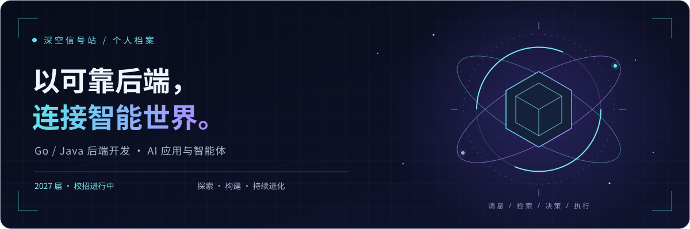

  

  <strong>2027 届 · 后端开发 · AI 应用 · 开源探索</strong> 
  安徽工业大学 · 数据科学与大数据技术 · 本科

  <a href="#实习航迹">实习航迹</a> ·
  <a href="#技术坐标">技术坐标</a> ·
  <a href="#探索日志">探索日志</a> ·
  <a href="mailto:054931g@gmail.com">联系我</a>

---

### 01 / 关于我

你好，欢迎来到我的技术空间。

我拥有 **Go 与 Java 后端开发实习经历**，参与过 AI 用户反馈分析与企业级物联网平台建设。喜欢把复杂业务拆解成清晰的流程，也关注系统在重复消息、失败重试和长时间运行下的表现。

目前沿着三个方向持续探索：**可靠的后端服务、可控的智能体工作流、能够被他人使用的开源工具**。正在寻找 2027 届后端开发与 AI 应用相关的校招机会。

> 从消息进入系统，到检索、决策与执行，让每一步都有依据，也有边界。

### 02 / 实习航迹

#### 万兴科技 · 后端开发实习

`2026.04 — 2026.08`　`Go / Python`　`AI 用户反馈分析`

面向多渠道用户反馈，参与智能分析与研发工单闭环建设。

- **异步处理**：参与基于 Protobuf、RabbitMQ 的事件接入与处理，结合 Redis 延迟防抖、业务幂等键和状态校验控制重复消费与分析。
- **检索与决策**：主导混合检索与历史工单关联，结合查询改写、向量召回、BM25 与 RRF 融合；负责规则、辅助模型与结构化大模型决策组成的受控工作流。
- **巡检智能体**：主导基于 OpenClaw 的巡检流程，将技能编排、确定性执行和证据复核分层，完成检测、证据采集与报告生成，关注资源回收与上下文成本。

展开：用户反馈聚类与问题洞察

参与跨批数据汇聚、去重与任务状态管理，融合语义向量和业务特征，按数据规模采用 KMeans / MiniBatchKMeans。结合噪声处理、代表样本筛选与大模型摘要，将分散反馈整理为问题主题与改进建议。

#### 南京宽塔 · 后端开发实习

`2025.11 — 2026.03`　`Java / Spring Cloud`　`物联网设备管理`

参与企业级设备管理平台，围绕设备接入、固件升级与运维问答开展开发。

- **设备接入**：参与 MQTT 消息订阅与异步处理，实现设备状态更新、属性解析和消息记录。
- **固件升级**：主导 OTA 升级闭环，负责固件包管理、版本校验、任务调度与进度追踪，使用 WebFlux / Reactor 实现非阻塞流式分发。
- **运维问答**：参与基于 Spring AI Alibaba 的问答流程，编排意图识别、知识检索、上下文组装与结构化回答，通过 SSE 提供流式输出。

### 03 / 技术坐标

<table>
<tr>
<td width="33%" valign="top">

**◈ 后端与并发**

Go · Java · Python 
Gin · Spring Boot · Spring Cloud 
异步处理 · 幂等设计 · 状态管理

</td>
<td width="33%" valign="top">

**⌁ 数据与消息**

MySQL · Redis · RabbitMQ 
Elasticsearch · MQTT 
混合检索 · 缓存 · 事件驱动

</td>
<td width="33%" valign="top">

**✧ 智能应用与交付**

RAG · 工具调用 · 智能体工作流 
Spring AI Alibaba · Langfuse 
Docker · Linux · Kubernetes

</td>
</tr>
</table>

### 04 / 探索日志

我希望持续回答这些工程问题，并把实践整理成可复现的作品：

- **可靠性**：重复消息、失败重试与状态流转，如何共同保证业务流程稳定运行？
- **智能体**：如何用确定性执行、人工审核与证据复核，让自动化保持可控？
- **检索**：关键词与语义召回如何协作，才能找到真正相关的业务信息？

展开：项目实践 · 智课云链

**在线教育平台｜2025.08 — 2025.10**

围绕内容管理、媒资处理、订单支付与认证授权开展项目实践。使用 MinIO 与 XXL-JOB 处理分块上传和异步任务，结合 RabbitMQ 实现支付通知与幂等消费，并通过缓存、网关鉴权和服务调用容错完善后端流程。

展开：教育与荣誉

- 安徽工业大学 · 数据科学与大数据技术 · 本科，2023.09 — 2027.06。
- 全国大学生数学建模竞赛赛区二等奖。
- 数维杯全国大学生数学建模竞赛三等奖。
- 安徽省大数据与人工智能应用竞赛二等奖。
- 大学英语六级。

---

  <strong>下一段航程，期待与你建立连接。</strong> 
  校招机会 · 后端技术交流 · 开源协作  
  <a href="mailto:054931g@gmail.com"><strong>054931g@gmail.com</strong></a>

保持好奇，把想法写成可以运行的系统。

